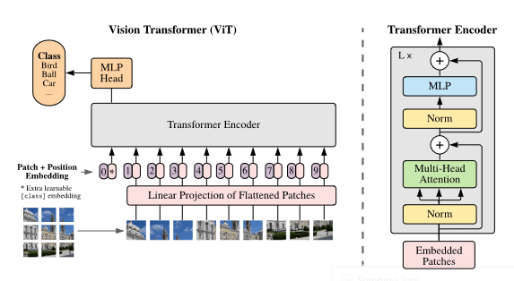

# Visual Transformer for Facial Emotion Recognition (FER)

  
	
  
  

This project has the aim to build an efficient Visual Transformer for the Facial Emotion Recognition (FER) task. Project is interally on Python Notebook, 
hosted on Google Colab with a runtime environment given by NVIDIA P100 or NVIDIA T4 GPU. 

## Dataset 

Dataset is formed by 8 different classes integrated by 3 different subsets:
1. **FER-2013:** It contains approximately 35,000 facial RGB images of different expressions with size restricted to 48×48, and the main labels of it can be divided into 7 types: 0=Angry, 1=Disgust, 2=Fear, 3=Happy, 4=Sad, 5=Surprise, 6=Neutral. The Disgust expression has the minimal number of images – 600, while other labels have nearly 5,000 samples each.
2. **CK+:** The Extended Cohn-Kanade (CK+) dataset contains some images extrapolated from 593 video sequences from a total of 123 different subjects, ranging from 18 to 50 years of age with a variety of genders and heritage. Each video shows a facial shift from the neutral expression to a targeted peak expression, recorded at 30 frames per second (FPS) with a resolution of either 640x490 or 640x480 pixels. Unfortunately, we don't have the entire generated datasets but we stored only 1000 images with high variance from a kaggle repository. 
3. **AffectNet:** It is a large facial expression dataset with 41.000 images classified in eight categories (neutral, happy, angry, sad, fear, surprise, disgust, contempt) of facial expressions along with the intensity of valence and arousal.

Data loading, integration and analysis are in the first part of the ViT-Emotion-Recognition.ipynb notebook. The result dataset is an integration divided by two subset (train an val folder) with 8 subfolder with the scope of the class label.

## Data Management

Given an eterogeneous dataset on a fine-tuned transformer, we had to manage some image features:
- **Data Scaling**: Pre-trained models are transformers with different configurations that train them on ImageNet dataset for the object detection with images on 224x224. We use the same scale and convert input data to this size.
- **Data Channels**: We use RGB channels for each images for the same reason of the previous point.
- **Data Augmentation**: We use brightness, rotation, scaling, translation and zooming augmentation to improve the amount of the samples and balance the dataset classes variation.

## Model

  

Overview of the model: The input image is split into fixed-sized patches; the embedding phase is preceded by a convolutional layer with a kernel 16x16 with a stride of 16x16. The output of the convolution is then used for the embedding phase where the resulting vector is given by the sum of the position embedding and a linear embedding in a projection space of 768 dimensions. The embedded patches are then processed by a set of 11 sequential Transformer Encoders.
For the classification task, the final layer is a linear layer with a 8 dimensional output for our eight emotions.
The model we rely on is pretrained on ImageNet and finetuned with the datased described above.

**Source:** https://github.com/google-research/vision_transformer
## Authors

- Andrea Gurioli (@andreagurioli1995)
- Mario Sessa (@kode-git)

## License

&copy; Apache License Version 2.0, January 2004
